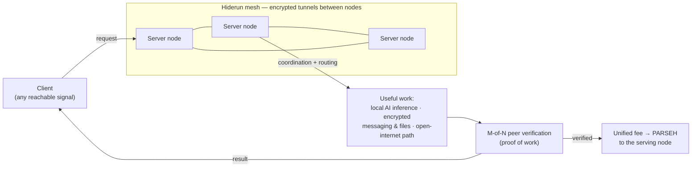

# PARSEH · Hiderun

**A community network designed to turn donated compute into free, peer-verified AI — and a safer path onto the open internet — for people priced out of, or cut off from, commercial services.**

Project site: **[hiderun.com](https://hiderun.com)**

> **Status — v0.1.0-alpha, engineering preview.** This README describes the design as it is *imagined*. Be clear about what that means: the coordination primitives are implemented and tested in harnesses; **the network does not form across the real internet yet** — there are no public nodes, no live tunnels, no chain, and no token in circulation. Nothing below is a working-product claim. It is the architecture we are building toward, in the open, with a hard rule against overclaiming.

---

## Mission

PARSEH exists so that people the AI era is leaving out — students and young builders, anyone without affordable or reachable commercial AI, anyone who must pay with their privacy just to get online — can **learn, build agents and workflows, and reach the open internet without paying and without revealing who they are.**

It is meant to be a shared ecosystem: people who can donate compute and bandwidth do so; people who need access use it; work is verified by peers, not gatekept by a company; contributions are rewarded; knowledge stays open. Education and open-source AI for people who currently get neither.

## The idea (how it is imagined)

**Hiderun is the connected network of all server nodes; clients are the people it serves.**

- **Clients** reach the network over *whatever signal they can use* — ordinary internet, a relay, or (researched, not built) other transports.
- **Server nodes** form a mesh. Between them run encrypted tunnels that carry traffic and a path to the open internet.
- The mesh handles **capability advertisement, coordination, and routing** of messages and work to the node that can serve them.
- A node that performs useful work — an action, an execution, serving a request — earns a **unified fee after proof of work**, paid in the network's unit, **PARSEH**.
- On that base, the network is meant to provide **encrypted message and file transfer** and **local AI generation** (inference + tools on contributor hardware) — as **infrastructure other services can be built on**, for free access to AI and education, and a way to keep working under restricted networks.

The wager behind it: **contribution, proven by verification — not identity, not money, not an authority's approval — is what earns trust and service.** Contributors and users are pseudonymous by design.

## What problems it is meant to solve

- **AI is paywalled or unreachable** for many builders, students, and researchers — by price, by sanctions, or by a restricted national network.
- **Open-internet access** is unreliable or blocked for the same people.
- **Centralised services** can be cut off, surveilled, or coerced at a single point.

PARSEH's answer: a volunteer mesh where compute is shared, work is *peer-verified* by M-of-N consensus, and no single party is in control.

## How it works



1. A client connects to a node and submits a request.
2. The mesh coordinates and routes it to a capable node; nodes relay over encrypted tunnels.
3. The node does the work — local LLM inference, message/file relay, or an open-internet path.
4. Other nodes **verify** the work by M-of-N consensus (proof of useful work).
5. Verified work earns the serving node a unified PARSEH fee. The client gets the result.
6. Verified, signed outcomes form shared state the network coordinates on.

*Today, steps 1–6 run only inside test harnesses on a single machine — the verification, signing, shared-state, and coordination code is real and tested; the multi-node live network is not yet stood up.*

## What actually works today

- `parseh-miner` — generates an ed25519 identity, joins libp2p, subscribes to the coordination topics, runs the finalise tick, opens encrypted local state, detects a local LLM. Single node.
- `parseh` CLI — local status / identity / submit / inspect commands.
- A multi-crate Rust workspace with a passing test suite, an offline 3-node acceptance test, and fuzz + chaos harnesses.

```bash
git clone https://github.com/hiderun-tui/parseh && cd parseh
bash scripts/demo.sh        # builds the core binaries + runs the offline 3-node acceptance test
```

## What we claim / what we do NOT claim

**We claim:** the *design* is a peer-verified network for free local-AI inference, encrypted messaging/files, and a safer path to the open internet, with donors rewarded for proven useful work; the **coordination core is real and tested** (signed tasks, M-of-N verification, encrypted shared state — reproducible via `scripts/demo.sh`); it is built pseudonymously, no investors, no token sale.

**We do NOT claim:** it is **v0.1.0-alpha** — no live multi-node network, no live tunnels, no chain, no token in circulation, no reward flowing. It is **not** a working VPN, not anonymity, not censorship-resistant. Free encrypted internet and donor rewards are the **goal**, not a service available today. We move the line between *built* and *aspired* only when code and tests move it.

## Status — done · in progress · open questions

- **Done:** coordination primitives (signed tasks, M-of-N verification, encrypted shared state); single-node miner + CLI; offline 3-node acceptance test; fuzz + chaos harnesses.
- **In queue (the load-bearing gap):** public bootstrap nodes and a live multi-node testnet — until this exists, nothing runs across the real internet.
- **To build:** live encrypted tunnels / open-internet path; the contribution-accounting and reward layer.
- **To research:** how clients on restricted networks reach the mesh (transport options); security behaviour at real-network scale; verification economics.

Contributors are welcome on any of these — see **Contribute** below and the issues tab.

## Build

```bash
cd server && cargo build --release --workspace && cargo test --workspace
```

## Contribute

Module status and where to start: [`ROADMAP.md`](./ROADMAP.md).

Pseudonymous contributors welcome — no real identity is ever required. High-value areas: bootstrap-node and multi-node testnet work (the load-bearing gap), more fuzz/chaos targets, and code clarity. Open an issue or a PR. Honest technical feedback is worth more than stars.

## Security

Report vulnerabilities privately via GitHub's "Report a vulnerability" — see [`SECURITY.md`](./SECURITY.md). Running a node may carry legal risk depending on your jurisdiction.

## License

[Apache 2.0](./LICENSE) · more at **[hiderun.com](https://hiderun.com)**.
